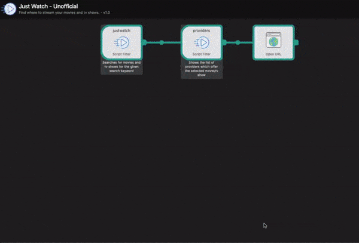

# Just Watch - Alfred Workflow
Alfred workflow to easily find where to stream your movies/tv-shows. Based on an unofficial Justwatch API.

## ⚛ Features
- Find where to stream your favourite movies and tv shows in an instant. 
- No more logging into each of netflix, Prime Video et al to check where a movie or tv-show is available.
- Search by region. Default region: AU (see instructions below to setup your region)
- Quick look - to enlarge movie posters or preview listing urls.

## ✅ Install

- Download and open the workflow file using [Alfred](https://www.alfredapp.com/).
- Get the latest release from here : 

P.S : I also made [this](https://vinaywadhwa.github.io/just-watch-voice/) Alexa & Google Home/Assistant Voice 🗣️ App which does the same thing as this workflow but with voice, on your smart home devices and mobile phones.

## 🛠 Setup:

- Set your [Country Code](https://en.wikipedia.org/wiki/ISO_3166-1_alpha-2?oldformat=true) in the workflow variables.
- Default country code/locale : AU

..and that's it. Start discovering right away!

## 👬 Contribution

- Report issues, Open pull request with improvements
- If you feel compelled, I'd love if you spread the word! Can share this workflow's [webpage](https://vinaywadhwa.github.io/justwatch-alfred/).
- Reach out with any feedback 
- Buy me a beer 

## 🏅 License

